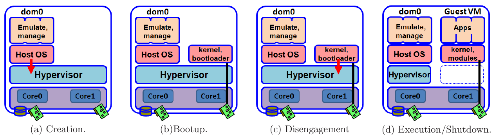
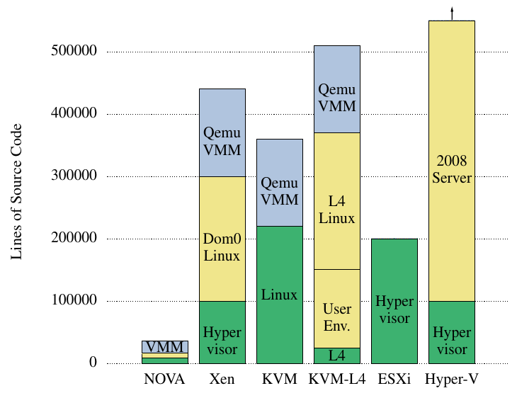
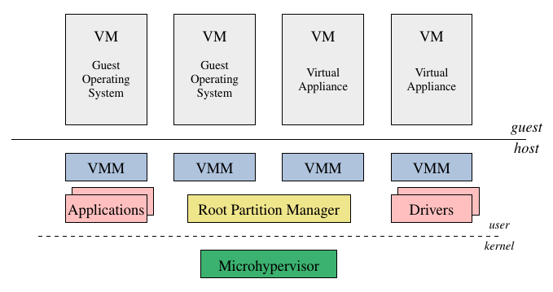

## Improve the security in the Virtual Machine Hypervisor
#### SR - Seminar

<small><a href="http://lucar.in">Luca Rinaldi</a></small>

## Agenda
- What is an hypervisor

- NoHype: remove the hypervisor

- NOVA: minimaize the hypervisor

- Conclusion

## Hypervisor
It **emulate** a given hardware and mislead the guest OS to run directily on it

It usually need a large and complex pice of software and a frequent interactions between the guest OS and the hypervisor.

A **VM exits** is generated by the vCPU when some operation done by the gust OS need the intervention of the hypervisor

## Security thread in virtualisation
The most important property that the hyprvisor is to maintain isolation between the VMs and the host.

There are cases in which, through an hypervisor vulnerability, an attacker can exit the virtual machine.

Usually hypervisors have a big TCB.

## NoHype
NoHype system that takes the novel approach of eliminating the hypervisor attack surface altogether.

They remove the need for virtual machines to constantly interact with the hypervisor during their lifetime.

## Main Design
- Pre-allocating Memory and Cores

- Using only Virtualized I/O Devices

- Short-Circuiting the System Discovery

- Avoiding Indirection

## Pre-allocating Memory and Cores
Avoiding hypervisor control on the dynamic allocation of memory and cores at runtime.

## Using only Virtualized I/O Devices
Associate at each VM a virtual I/O devices.

This is possible because in the cloud there is not need of a lot of devices.

The VM can have only a NIC card with virtualisation technology and the Storage can be used with the network.

## Short-Circuiting the System Discovery
The guest OS do not have to run the discovery of the hardware during the execution, because there is not any hypervisor to answer.

To achieve that they modify the kernel of the guest OS perform that operation only in the startup phase cache the answer.

## Avoiding Indirection
The hypervaisor give the illusion to the gust WM o is alone on the system by starting the processo ID from 0 for each VM.

By the static allocation of the cores to VM, it can access to the corret process ID avoid indirection.

In this way also the re-route of the interrupts is not needed.

## Prototype Design

Xen 4.0, Linux 2.6.35.4, Intel XEON W5580, NIC Intel 82576 Ethernet controller

## VM Creation
The Xen hypervisor manage the initialization of the virtual machine:

- set the affinity of the core

- set the NIC by a PCI pass through

- set the memory allocation using VT-d

## VM Bootup
There are three main phase:

- load the kernel and the initial RAM disk using the network.

- run the modified Linux kernel (discovery devices and capability)

- Hypervisor disengagement, using though a custom linux module

- iSCI drives mount

- start user code execution

## VM Shutdown
They configure the controller structure (VMCS) of the cpu to exit the VM mode when it receive a NMI interruption.

This also give the possibility to the VM to handler the exit and so shutdown correctly.

## Problems of this approach

- static allocation of the resource can create manage problem on the cloud provider (no more one VM per core). <!-- .element: class="fragment" -->
- In particular, the virtualisation layer could no longer be used for interposition, which is necessary for live migration, memory sharing and compression, and security enhancements. <!-- .element: class="fragment" -->

- It still trusts the VM management software. <!-- .element: class="fragment" -->

- requires changes to existing hardware and virtualisation stack. <!-- .element: class="fragment" -->

- It only considers software attacks and cannot guard against inspecting a VM disk, bus snooping and memory freezing. <!-- .element: class="fragment" -->

- The modified Kernel can have vulnerability or incompatibility. <!-- .element: class="fragment" -->

- Without indirection guest can easily know to be in a VM <!-- .element: class="fragment" -->

note:
On the software side, NoHype [21, 22] advocates space-partitioning cores, memory and devices to a VM, detaching the virtualization layer during a VM’s normal execution time. This reduces the attack surfaces for a VM as the VM is physically isolated from other VMs as well as the management VM for most of the time. Compared to NoHype, HyperCoffer assumes a stronger adversary model that further considers physical attacks, while NoHype only considers software attacks and cannot guard against sophisticated attacks such as inspecting a VM disk, bus snooping and memory freezing. Further, HyperCoffer still retains most functionalities in a commercial hypervisor like time-multiplexing resources, which are currently absent in NoHype.

NoHype [31] tries to address the trustworthiness of multi-tenant
clouds by removing the virtualization layer during execution. However,
removing the virtualization layer may also lose some useful
features such as sharing resources across multiple VMs, which are
key features of multi-tenant clouds. Further, NoHype still trusts the
VM management software and requires changes to existing hardware
and virtualization stack and there is no available implementation
of such a system.

NoHype [23] advocates removing the hypervisor altogether, using
static partitioning of CPUs, memory, and peripherals among VMs.
This would allow a host to be shared by multiple operating systems,
but with none of the other benefits of virtualization. In particular, the
virtualization layer could no longer be used for interposition, which
is necessary for live migration [13], memory sharing and compression
[19, 32], and security enhancements [11, 30, 46, 16].

## NOVA
It is a micro-hypervisor that minimizes the amount of code in the privileged hypervisor.

- Implement the virtualisation at user level.

- It reduce the trusted computing base of the virtual machines by at least an order of magnitude.

## Line of code

## Design

It use the design principle of the least privilege of the components.

## Microhypervisor
It implements a capability-based hypercall interface

Capabilities are opaque and immutable to the user, they cannot be inspected, modified, or addressed directly.

The use of capabilities leads to fine-grained access control.

It is possible to delegates copies of the capability with the same or reduced permissions to other domains that require access to the object.

note:
Five different type of kernel object:
- protection domains
- execution contexts
- scheduling contexts
- portals
- semaphores

## Root Partition Manager
It manage all the memory regions, I/O ports, and interrupts of the system.

It is the first protected domain created by the micro-hypervisor and it can create and delegate new protected domain to assign resources.

## Virtual-Machine Monitor
It supports the execution of an unmodified guest operating system in a virtual machine, emulating sensitive instructions and providing virtual devices.

It runs as a user-level application in an address space on top of the micro-hypervisor

## Problem of the NOVA approach

- This system does not defend from attack inside the cloud provider. <!-- .element: class="fragment" -->

- It do not provide the rich set of features necessary for deployment in commercial hosting environments. <!-- .element: class="fragment" -->

- They had to remove large hardware support to achieve a reduction of the TCB. <!-- .element: class="fragment" -->

- They assume that and attacker can not violate the booting sequence. <!-- .element: class="fragment" -->

- The microhypervisor is still in charge of complex management duties like address space management, interrupt and exception handling, and communication between the running workloads. <!-- .element: class="fragment" -->

- the formal verification of the mirohypervisor is infeasible so far. <!-- .element: class="fragment" -->

note:
NOVA [60] is micro-kernel based VMM that decouples the traditional monolithic VMM into a component-based system, and improves security by introducing capability-based access control for different components in a VMM. The security of the management software in However, these systems aim at protecting the virtualization layer from external attacks to the VM stack, but without considering possible attacks that leverage legal maintenance operations from the cloud operators, which is a new requirement in multi-tenant cloud.

However, these approaches mostly only protect
VMMs from attacks from a malicious guest VM, without consider-
203
ation of preventing an operator with control of management tools
and control VM from tampering with or stealing users’ confidential
data, especially external storage such as virtual disks. Further, they
require changes to the core parts of a VMM [68] or even a complete
reconstruction of VMMs [31, 60], thus may pose a notable

For example, they cannot defend against attacks leveraging
legal maintenance operations such as dump/clone/migrate a VM or
virtual disks. Further, they require a reconstruction of the cloud
software stack. To this end, it is critical to provide multi-tenant
cloud with an approach that defending against attackers penetrated
through the three attack surfaces from tampering with tenant VMs,
yet with a small trusted computing base, which motivates the design
and implementation of CloudVisor.

In this vein, from-scratch
hypervisors [38, 40, 42] have shown that particular security properties
can be achieved by rearchitecting the platform, but they do not
provide the rich set of features necessary for deployment in commercial
hosting environments.

More recently, NOVA [42]
uses a similar architecture and explicitly partitions the TCB into
several user-level processes within the hypervisor. Although capable
of running multiple unmodified OSes concurrently, the removal
of the control VM and requirement for NOVA-specific drivers sacrifice
hardware support for TCB size. Also, it is far from complete:
it cannot run Windows guests and has limited toolstack support.

To our knowledge, most of the other SRTM-based
approaches assume that the attacker is unable to violate the
integrity of the booting process (e.g. NOVA [35] explicitly
claims so). However, the boot chain nowadays can be com-
plex and repetitive. For example, GRUB 2 [14] nowadays
contains ∼200K LOCs in total and even GRUB Legacy con-
tains ∼10K LOCs as its core components. Some of the ini-
tialization duties of the bootloader have already be carried
out by the BIOS and will later be covered again by the
VMM. It can largely decrease the TCB size if we merge
them together into the BIOS and remove unnecessary boot
procedures.

There are some approaches directly dividing VMM into
separated components with different privileges. NOVA [35]
constructs a microkernel-based VMM that is ∼9K LOCs in
size. Despite its thin TCB compared to commodity hypervi-
sors, the complexity of TCB is not markedly decreased since
the microhypervisor is still in charge of complex manage-
ment duties like address space management, interrupt and
exception handling, and communication between the run-
ning workloads. So the thin TCB is still difficult to be se-
cured and verified dynamically. Although seL4 [21] pro-
poses a technique to formally verify a microkernel with
∼8.7K LOCs, it imposes several restrictions on the micro-
kernel functionality. Thus a verifiable microhypervisor re-
mains impractical so far. Other than microkernel-based sys-
tems, VMM Disaggregation [30] also shrinks the TCB size
by moving some VMM components out of the privileged do-
main. However, the TCB size is still too large for dynamic
protection.

## Conclusions
The Virtual Machine are one of the most important component of the Cloud and so their security is very important. <!-- .element: class="fragment" -->

The hypervisor have to improve their security and reliable but either the approach of the NOVA and the one of NoHype are to drastic to be actually implemented in real life. <!-- .element: class="fragment" -->

## References

- Szefer, J., Keller, E., Lee, R. B., \& Rexford, J. (2011, October). **Eliminating the hypervisor attack surface for a more secure cloud.** In Proceedings of the 18th ACM conference on Computer and communications security (pp. 401-412). ACM.

- Steinberg, U., \& Kauer, B. (2010, April). **NOVA: a microhypervisor-based secure virtualization architecture.** In Proceedings of the 5th European conference on Computer systems (pp. 209-222). ACM.

- Zhang, Y., Pan, W., Wang, Q., Bai, K., \& Yu, M. (2012). **HypeBIOS: Enforcing VM Isolation with Minimized and Decomposed Cloud TCB.** Virginia Commonwealth University, Technical report.

- Zhang, F., Chen, J., Chen, H., \& Zang, B. (2011, October). **CloudVisor: retrofitting protection of virtual machines in multi-tenant cloud with nested virtualization.** In Proceedings of the Twenty-Third ACM Symposium on Operating Systems Principles (pp. 203-216). ACM.
